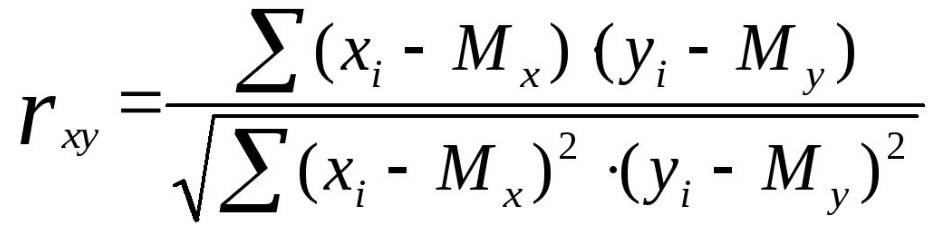

# Список проектов, подготовленных по курсу Парадигмы при обучении в GeekBrains:
1. HW_Les_1:
- основные:
   - task_1: 
   - 1. Дан список целых чисел numbers. Необходимо написать в императивном стиле процедуру для
сортировки числа в списке в порядке убывания. Можно использовать любой алгоритм сортировки.
   - 2. Написать точно такую же процедуру, но в декларативном стиле
- доплнительные:
   - task_3 - У вас есть массив целых чисел, в котором каждое число, кроме одного, повторяется дважды. Вам нужно найти это одиночное число. Пример: Входной массив: [4, 3, 2, 4, 1, 3, 2] Результат: 1
   В данной задаче вы должны найти способ найти одиночное число с использованием массивов и алгоритмов.
    - task_4 - У вас есть массив, содержащий числа от 1 до N, где N - длина массива. Одно из чисел в массиве повторяется дважды, а одно число пропущено. Найдите повторяющееся число и пропущенное число. Пример: Входной массив: [2, 3, 1, 5, 3] Повторяющееся число: 3 Пропущенное число: 4

2. HW_Les_2:
- основные:
  1. task_1 - Таблица умножения
  Условие: На вход подается число n.
  Задача: Написать скрипт в любой парадигме, который выводит на экран таблицу умножения всех чисел от 1 до n. Обоснуйте выбор парадигм.
  Пример вывода: 
  1 * 1 = 1
  1 * 2 = 2...2. 
3. HW_Les_3:
   Написать игру в “Крестики-нолики”. Можете использовать
   любые парадигмы, которые посчитаете наиболее
   подходящими. Можете реализовать доску как угодно - как
   одномерный массив или двумерный массив (массив массивов).
   Можете использовать как правила, так и хардкод, на своё
   усмотрение. Главное, чтобы в игру можно было поиграть через
   терминал с вашего компьютера.
4. HW_Les_4:
   Написать скрипт для расчета корреляции Пирсона между
   двумя случайными величинами (двумя массивами). Можете
   использовать любую парадигму, но рекомендую использовать
   функциональную, т.к. в этом примере она значительно
   упростит вам жизнь.
   Формула корреляции Пирсона:
   
5. HW_Les_5:
Написать программу на языке Prolog для вычисления суммы
элементов списка. На вход подаётся целочисленный массив.
На выходе - сумма элементов массива.
6. HW_Les_6:
Написать программу на любом языке в любой парадигме для
бинарного поиска. На вход подаётся целочисленный массив и
число. На выходе - индекс элемента или -1, в случае если искомого
элемента нет в массиве.